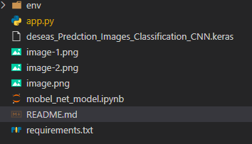
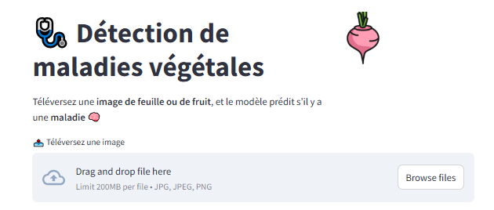
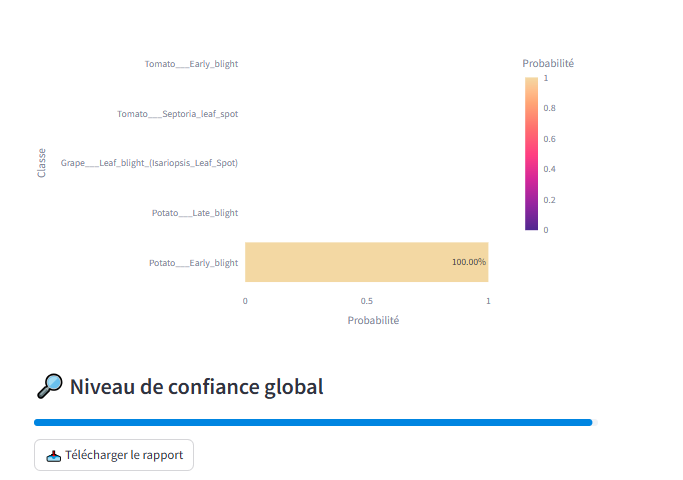

# 🌿 Détection de Maladies Végétales via Images

Ce projet est une application web interactive développée avec **Streamlit** permettant de détecter automatiquement les maladies de différentes plantes à partir d'images de feuilles ou de fruits. Le modèle est basé sur un réseau de neurones convolutif (CNN) entraîné sur 39 classes de maladies.

---

## 🚀 Fonctionnalités

- 📸 Téléversement d'image de feuille ou de fruit
- 🤖 Prédiction automatique de la maladie à l'aide d'un modèle mobelNet'Keras'
- 📊 Affichage des 5 classes les plus probables avec leurs pourcentages
- 📈 Visualisation des probabilités avec un graphique interactif
- 🎯 Affichage de la barre de confiance pour la classe prédite

---

## 🧠 Modèle

Le modèle utilisé est un **CNN (Convolutional Neural Network)** entraîné sur un dataset contenant 39 classes de maladies et états de santé de différentes plantes telles que :

- Pomme, Raisin, Maïs, Tomate, Fraise, Orange, Pêche, Pomme de terre, etc.
- Classes comme : `Apple___Apple_scab`, `Tomato___Late_blight`, `Potato___healthy`, etc.

---

## 📦 Technologies utilisées

- [Python 3.8+](https://www.python.org/)
- [TensorFlow / Keras](https://www.tensorflow.org/)
- [Streamlit](https://streamlit.io/)
- [NumPy](https://numpy.org/)
- [Pandas](https://pandas.pydata.org/)
- [Plotly](https://plotly.com/python/) (pour les visualisations)

---
## 📁 Structure du projet

## 📸 Capture d'écran




---

## 🛠️ Installation

1. Clone le dépôt :

```bash
git clone https://github.com/hamza-tourmine/Detection-Plants-Maladies.git
cd Detection-Plants-Maladies
```

2. Installez les dépendances :
```bash
pip install -r requirements.txt
```
3. Télécharger le modèle entraîné :
Le fichier du modèle deseas_Prediction_Images_Classification_CNN.keras (taille > 100 Mo) ne peut pas être hébergé sur GitHub à cause de la limite de 100 Mo. Vous pouvez le télécharger via le lien suivant :

🔗 [https://drive.google.com/file/d/1S5gN-NDccFJZxu_lNhsUC_r-Q2TxUSb3/view?usp=sharing]

Une fois téléchargé, placez le fichier deseas_Prediction_Images_Classification_CNN.keras dans le répertoire racine du projet (au même niveau que app.py).

4. Lancez l'application :
```bash
streamlit run app.py
````

